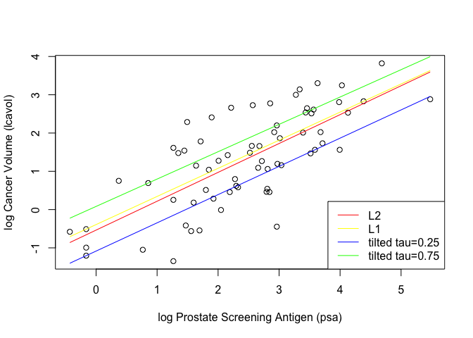

``` r
library('ElemStatLearn')
```

``` r
## load prostate data
data("prostate")
```

``` r
## subset to training examples
prostate_train <- subset(prostate, train==TRUE)
```

Write functions that implement the L1 loss and tilted absolute loss functions
-----------------------------------------------------------------------------

``` r
## L1 loss function
L1_loss <- function(y, yhat)
  abs(y-yhat)
```

``` r
## L2 loss function
L2_loss <- function(y, yhat)
  (y-yhat)^2
```

``` r
## tilted absolute loss function for tau=0.25
tilted_abs_loss_0.25 <- function(y, yhat){
  ifelse(y-yhat > 0, 0.25*(y-yhat), -0.75*(y-yhat))
}
```

``` r
## tilted absolute loss function for tau=0.75
tilted_abs_loss_0.75 <- function(y, yhat){
  ifelse(y-yhat > 0, 0.75*(y-yhat), -0.25*(y-yhat))
}
```

Create a figure that shows lpsa (x-axis) versus lcavol (y-axis). Add and label (using the ‘legend’ function) the linear model predictors associated with L2 loss, L1 loss, and tilted absolute value loss for tau = 0.25 and 0.75.
----------------------------------------------------------------------------------------------------------------------------------------------------------------------------------------------------------------------------------

``` r
## fit simple linear model using numerical optimization
fit_lin <- function(y, x, loss, beta_init = c(-0.51, 0.75)) {
  err <- function(beta)
    mean(loss(y,  beta[1] + beta[2]*x))
  beta <- optim(par = beta_init, fn = err)
  return(beta)
}
```

``` r
## make predictions from linear model
predict_lin <- function(x, beta)
  beta[1] + beta[2]*x
```

### L2 loss

``` r
## fit linear model
## fit linear model
lin_beta_L2 <- fit_lin(y=prostate_train$lcavol,
                    x=prostate_train$lpsa,
                    loss=L2_loss)
```

``` r
## compute predictions for a grid of inputs
x_grid <- seq(min(prostate_train$lpsa),
              max(prostate_train$lpsa),
              length.out=100)
lin_pred_L2 <- predict_lin(x=x_grid, beta=lin_beta_L2$par)
```

### L1 loss

``` r
## fit linear model
lin_beta_L1 <- fit_lin(y=prostate_train$lcavol,
                    x=prostate_train$lpsa,
                    loss=L1_loss)
```

``` r
lin_pred_L1 <- predict_lin(x=x_grid, beta=lin_beta_L1$par)
```

### tilted absolute value loss for tau = 0.25

``` r
lin_beta_tilted0.25 <- fit_lin(y=prostate_train$lcavol,
                    x=prostate_train$lpsa,
                    loss=tilted_abs_loss_0.25)
```

``` r
lin_pred_tilted0.25 <- predict_lin(x=x_grid, beta=lin_beta_tilted0.25$par)
```

### tilted absolute value loss for tau = 0.75

``` r
lin_beta_tilted0.75 <- fit_lin(y=prostate_train$lcavol,
                    x=prostate_train$lpsa,
                    loss=tilted_abs_loss_0.75)
```

``` r
lin_pred_tilted0.75 <- predict_lin(x=x_grid, beta=lin_beta_tilted0.75$par)
```

``` r
## plot lcavol vs lpsa
plot_psa_data <- function(dat=prostate_train) {
  plot(dat$lpsa, dat$lcavol,
       xlab="log Prostate Screening Antigen (psa)",
       ylab="log Cancer Volume (lcavol)")
}
```

``` r
## plot data
plot_psa_data()
lines(x=x_grid, y=lin_pred_L2,col="red")
lines(x=x_grid, y=lin_pred_L1,col="yellow")
lines(x=x_grid, y=lin_pred_tilted0.25,col="blue")
lines(x=x_grid, y=lin_pred_tilted0.75,col="green")
legend("bottomright", 
  legend = c("L2", "L1","tilted tau=0.25","tilted tau=0.75"), 
  col = c("red","yellow","blue","green"), 
  lty = c(1,1,1,1)
  )
```



a simple exponential (nonlinear) model
--------------------------------------

``` r
## fit simple exponential model using numerical optimization
fit_exp <- function(y, x, loss, beta_init = c(-1.0, 0.0, -0.3)) {
  err <- function(beta)
    mean(loss(y, beta[1] + beta[2]*exp(-beta[3]*x)))
  beta <- optim(par = beta_init, fn = err)
  return(beta)
}
```

``` r
## make predictions from exponential model
predict_exp <- function(x, beta)
  beta[1] + beta[2]*exp(-beta[3]*x)
```

### L2 loss

``` r
## fit linear model
## fit linear model
exp_beta_L2 <- fit_exp(y=prostate_train$lcavol,
                    x=prostate_train$lpsa,
                    loss=L2_loss)
```

``` r
## compute predictions for a grid of inputs
exp_pred_L2 <- predict_exp(x=x_grid, beta=exp_beta_L2$par)
```

### L1 loss

``` r
## fit linear model
exp_beta_L1 <- fit_exp(y=prostate_train$lcavol,
                    x=prostate_train$lpsa,
                    loss=L1_loss)
```

``` r
exp_pred_L1 <- predict_exp(x=x_grid, beta=exp_beta_L1$par)
```

### tilted absolute value loss for tau = 0.25

``` r
exp_beta_tilted0.25 <- fit_exp(y=prostate_train$lcavol,
                    x=prostate_train$lpsa,
                    loss=tilted_abs_loss_0.25)
```

``` r
exp_pred_tilted0.25 <- predict_exp(x=x_grid, beta=exp_beta_tilted0.25$par)
```

### tilted absolute value loss for tau = 0.75

``` r
exp_beta_tilted0.75 <- fit_exp(y=prostate_train$lcavol,
                    x=prostate_train$lpsa,
                    loss=tilted_abs_loss_0.75)
```

``` r
exp_pred_tilted0.75 <- predict_exp(x=x_grid, beta=exp_beta_tilted0.75$par)
```

``` r
## plot lcavol vs lpsa
plot_psa_data <- function(dat=prostate_train) {
  plot(dat$lpsa, dat$lcavol,
       xlab="log Prostate Screening Antigen (psa)",
       ylab="log Cancer Volume (lcavol)")
}
```

``` r
## plot data
plot_psa_data()
lines(x=x_grid, y=exp_pred_L2,col="red")
lines(x=x_grid, y=exp_pred_L1,col="yellow")
lines(x=x_grid, y=exp_pred_tilted0.25,col="blue")
lines(x=x_grid, y=exp_pred_tilted0.75,col="green")
legend("bottomright", 
  legend = c("L2", "L1","tilted tau=0.25","tilted tau=0.75"), 
  col = c("red","yellow","blue","green"), 
  lty = c(1,1,1,1)
  )
```


