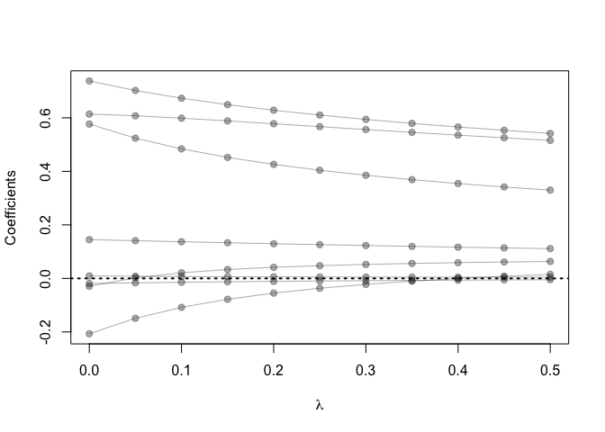
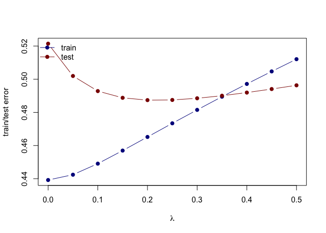

Use the cor function to reproduce the correlations listed in HTF Table
3.1, page 50.

``` r
cor(prostate)
```

    ##              lcavol      lweight       age         lbph         svi
    ## lcavol   1.00000000  0.280521386 0.2249999  0.027349703  0.53884500
    ## lweight  0.28052139  1.000000000 0.3479691  0.442264395  0.15538491
    ## age      0.22499988  0.347969112 1.0000000  0.350185896  0.11765804
    ## lbph     0.02734970  0.442264395 0.3501859  1.000000000 -0.08584324
    ## svi      0.53884500  0.155384906 0.1176580 -0.085843238  1.00000000
    ## lcp      0.67531048  0.164537146 0.1276678 -0.006999431  0.67311118
    ## gleason  0.43241706  0.056882099 0.2688916  0.077820447  0.32041222
    ## pgg45    0.43365225  0.107353790 0.2761124  0.078460018  0.45764762
    ## lpsa     0.73446033  0.433319385 0.1695928  0.179809404  0.56621822
    ## train   -0.04654347 -0.009940651 0.1776155 -0.029939957  0.02679950
    ##                  lcp     gleason      pgg45        lpsa        train
    ## lcavol   0.675310484  0.43241706 0.43365225  0.73446033 -0.046543468
    ## lweight  0.164537146  0.05688210 0.10735379  0.43331939 -0.009940651
    ## age      0.127667752  0.26889160 0.27611245  0.16959284  0.177615517
    ## lbph    -0.006999431  0.07782045 0.07846002  0.17980940 -0.029939957
    ## svi      0.673111185  0.32041222 0.45764762  0.56621822  0.026799505
    ## lcp      1.000000000  0.51483006 0.63152825  0.54881317 -0.037427296
    ## gleason  0.514830063  1.00000000 0.75190451  0.36898681 -0.044171456
    ## pgg45    0.631528246  0.75190451 1.00000000  0.42231586  0.100516371
    ## lpsa     0.548813175  0.36898681 0.42231586  1.00000000 -0.033889743
    ## train   -0.037427296 -0.04417146 0.10051637 -0.03388974  1.000000000

Treat lpsa as the oucome, and use all other variables in the data set as
predictors.

With the training subset, train a least-squares regression model with
all predictors using the lm function (with the training subset).

``` r
prostate_train <- prostate %>%
  filter(train == TRUE) %>% 
  select(-train)
```

predict lpsa consider all other predictors  
lm fits using L2 loss

``` r
fit <- lm(lpsa ~ ., data=prostate_train)
summary(fit)
```

    ## 
    ## Call:
    ## lm(formula = lpsa ~ ., data = prostate_train)
    ## 
    ## Residuals:
    ##      Min       1Q   Median       3Q      Max 
    ## -1.64870 -0.34147 -0.05424  0.44941  1.48675 
    ## 
    ## Coefficients:
    ##              Estimate Std. Error t value Pr(>|t|)    
    ## (Intercept)  0.429170   1.553588   0.276  0.78334    
    ## lcavol       0.576543   0.107438   5.366 1.47e-06 ***
    ## lweight      0.614020   0.223216   2.751  0.00792 ** 
    ## age         -0.019001   0.013612  -1.396  0.16806    
    ## lbph         0.144848   0.070457   2.056  0.04431 *  
    ## svi          0.737209   0.298555   2.469  0.01651 *  
    ## lcp         -0.206324   0.110516  -1.867  0.06697 .  
    ## gleason     -0.029503   0.201136  -0.147  0.88389    
    ## pgg45        0.009465   0.005447   1.738  0.08755 .  
    ## ---
    ## Signif. codes:  0 '***' 0.001 '**' 0.01 '*' 0.05 '.' 0.1 ' ' 1
    ## 
    ## Residual standard error: 0.7123 on 58 degrees of freedom
    ## Multiple R-squared:  0.6944, Adjusted R-squared:  0.6522 
    ## F-statistic: 16.47 on 8 and 58 DF,  p-value: 2.042e-12

``` r
coef(fit)
```

    ##  (Intercept)       lcavol      lweight          age         lbph 
    ##  0.429170133  0.576543185  0.614020004 -0.019001022  0.144848082 
    ##          svi          lcp      gleason        pgg45 
    ##  0.737208645 -0.206324227 -0.029502884  0.009465162

``` r
residuals(fit)
```

    ##             1             2             3             4             5 
    ## -1.1843214831 -0.8629238799 -0.6115844941 -0.7193922821 -1.3285194027 
    ##             6             7             8             9            10 
    ##  0.0008460789 -1.3772752449 -0.1951878926  0.3093021281 -0.7514481545 
    ##            11            12            13            14            15 
    ## -0.4266131690 -0.4044823273  0.0707411519 -0.7879071619  0.3174831835 
    ##            16            17            18            19            20 
    ## -0.3028839782 -0.3384054362  0.6353601587 -0.8465604301 -0.3936410576 
    ##            21            22            23            24            25 
    ## -0.4015979194 -0.0496701613 -0.2177761605  0.0352948491  1.0592244227 
    ##            26            27            28            29            30 
    ##  0.5695926391  1.2359025317 -1.6487027458  0.5923365128  0.1445158115 
    ##            31            32            33            34            35 
    ##  0.2066060535  0.0712632096 -0.0699459329 -1.5275919017  0.0860012447 
    ##            36            37            38            39            40 
    ## -0.5022256852 -0.3445277222  0.4020117840  0.4968102377 -0.0799295442 
    ##            41            42            43            44            45 
    ##  0.3120736264 -0.0835518114 -0.2060108514 -0.1644419501  1.4867538012 
    ##            46            47            48            49            50 
    ## -0.0542373310 -0.1821294558  0.7814591518 -0.0606455149 -0.1117554254 
    ##            51            52            53            54            55 
    ## -0.1155433743 -0.1596029492  0.1541283629  1.4022395347  0.6579137611 
    ##            56            57            58            59            60 
    ##  0.0821686050  0.9641240691 -0.0647008999  0.5481931550  0.8423039905 
    ##            61            62            63            64            65 
    ## -0.1148808899  0.6300265742  0.5941586902 -0.0129417649  0.6110039917 
    ##            66            67 
    ##  0.2346000317  1.1691170422

``` r
prostate_test <- prostate %>%
  filter(train == FALSE) %>% 
  select(-train)
```

``` r
L2_loss <- function(y, yhat)
  (y-yhat)^2
error <- function(dat, fit, loss=L2_loss)
  mean(loss(dat$lcavol, predict(fit, newdata=dat)))
```

``` r
## testing error
error(prostate_test, fit)
```

    ## [1] 1.474148

``` r
## use glmnet to fit lasso
## glmnet fits using penalized L2 loss
## first create an input matrix and output vector
form  <- lpsa ~ 0 + lweight + age + lbph + lcp + pgg45 + lcavol + svi + gleason
x_inp <- model.matrix(form, data=prostate_train)
y_out <- prostate_train$lpsa
fit <- glmnet(x=x_inp, y=y_out, alpha=0, lambda=seq(0.5, 0, -0.05))
print(fit$beta)
```

    ## 8 x 11 sparse Matrix of class "dgCMatrix"

    ##    [[ suppressing 11 column names 's0', 's1', 's2' ... ]]

    ##                                                                          
    ## lweight  0.515697286  0.525400575  0.5354170019  0.545775814  0.556311619
    ## age     -0.004889276 -0.005637483 -0.0064660393 -0.007390172 -0.008436051
    ## lbph     0.111264821  0.113946024  0.1167762533  0.119749176  0.122883708
    ## lcp      0.015168605  0.007943168 -0.0003765233 -0.010208916 -0.022217776
    ## pgg45    0.004390331  0.004515174  0.0046637167  0.004840594  0.005062742
    ## lcavol   0.329947512  0.341656357  0.3545916725  0.369018247  0.385454679
    ## svi      0.541710372  0.553480497  0.5659053246  0.579302886  0.594067995
    ## gleason  0.063402833  0.061373728  0.0588793776  0.055915056  0.052224299
    ##                                                                         
    ## lweight  0.567083034  0.577904675  0.588577079  0.598728953  0.607640794
    ## age     -0.009617693 -0.010968049 -0.012524059 -0.014335139 -0.016468427
    ## lbph     0.126178477  0.129642591  0.133272193  0.137050755  0.140935937
    ## lcp     -0.036796539 -0.054965954 -0.078076538 -0.108262379 -0.149116876
    ## pgg45    0.005340520  0.005702607  0.006189804  0.006872589  0.007882003
    ## lcavol   0.404236189  0.426145259  0.452197566  0.483962606  0.524027412
    ## svi      0.610303587  0.628512630  0.649279407  0.673464940  0.702375090
    ## gleason  0.047591554  0.041501934  0.033149650  0.021047902  0.002236316
    ##                     
    ## lweight  0.613980850
    ## age     -0.019008894
    ## lbph     0.144825646
    ## lcp     -0.206830251
    ## pgg45    0.009471377
    ## lcavol   0.576765946
    ## svi      0.737805454
    ## gleason -0.029463345

``` r
## plot path diagram
plot(x=range(fit$lambda),
     y=range(as.matrix(fit$beta)),
     type='n',
     xlab=expression(lambda),
     ylab='Coefficients')
for(i in 1:nrow(fit$beta)) {
  points(x=fit$lambda, y=fit$beta[i,], pch=19, col='#00000055')
  lines(x=fit$lambda, y=fit$beta[i,], col='#00000055')
}
abline(h=0, lty=3, lwd=2)
```



``` r
## functions to compute testing/training error with glmnet
error <- function(dat, fit, lam, form, loss=L2_loss) {
  x_inp <- model.matrix(form, data=dat)
  y_out <- dat$lpsa
  y_hat <- predict(fit, newx=x_inp, s=lam)  ## see predict.elnet
  mean(loss(y_out, y_hat))
}
```

``` r
## compute training and testing errors as function of lambda
err_train_1 <- sapply(fit$lambda, function(lam) 
  error(prostate_train, fit, lam, form))
err_test_1 <- sapply(fit$lambda, function(lam) 
  error(prostate_test, fit, lam, form))
```

``` r
## plot test/train error
plot(x=range(fit$lambda),
     y=range(c(err_train_1, err_test_1)),
     type='n',
     xlab=expression(lambda),
     ylab='train/test error')
points(fit$lambda, err_train_1, pch=19, type='b', col='darkblue')
points(fit$lambda, err_test_1, pch=19, type='b', col='darkred')
legend('topleft', c('train','test'), lty=1, pch=19,
       col=c('darkblue','darkred'), bty='n')
```


