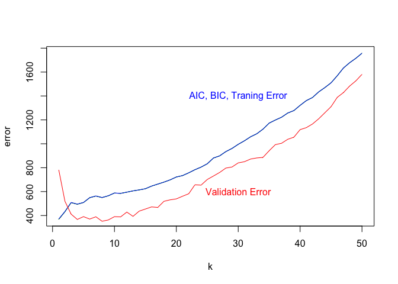
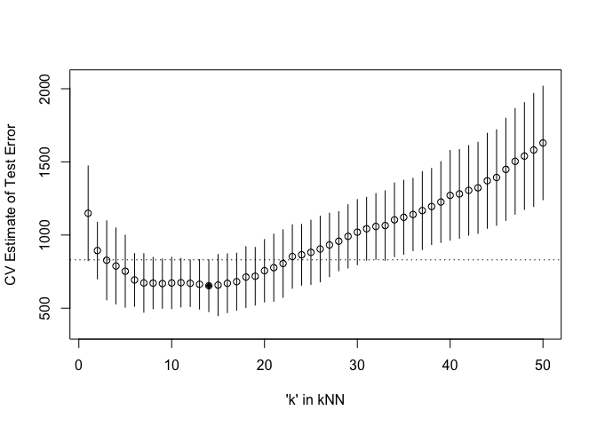

``` r
library('MASS') ## for 'mcycle'
library('manipulate')
library('splines') ## 'ns'
library('caret') ## 'knnreg' and 'createFolds'
```

    ## Loading required package: lattice

    ## Loading required package: ggplot2

1.  Randomly split the mcycle data into training (75%) and validation
    (25%) subsets.

``` r
smp_size <- floor(0.75 * nrow(mcycle))
set.seed(123)
train_ind <- sample(seq_len(nrow(mcycle)), size = smp_size)
training <- mcycle[train_ind, ]
validation <- mcycle[-train_ind, ]
```

1.  Using the mcycle data, consider predicting the mean acceleration as
    a function of time. Use the Nadaraya-Watson method with the k-NN
    kernel function to create a series of prediction models by varying
    the tuning parameter over a sequence of values.

``` r
y <- training$accel
x <- matrix(training$times, length(training$times), 1)
```

``` r
## k-NN kernel function
## x  - n x p matrix of training inputs
## x0 - 1 x p input where to make prediction
## k  - number of nearest neighbors
kernel_k_nearest_neighbors <- function(x, x0, k) {
  ## compute distance betwen each x and x0
  z <- t(t(x) - x0)
  d <- sqrt(rowSums(z*z))

  ## initialize kernel weights to zero
  w <- rep(0, length(d))
  
  ## set weight to 1 for k nearest neighbors
  w[order(d)[1:k]] <- 1
  
  return(w)
}
```

``` r
## Make predictions using the NW method
## y  - n x 1 vector of training outputs
## x  - n x p matrix of training inputs
## x0 - m x p matrix where to make predictions
## kern  - kernel function to use
## ... - arguments to pass to kernel function
nadaraya_watson <- function(y, x, x0, kern,...) {
  k <- t(apply(x0, 1, function(x0_) {
    k_ <- kern(x, x0_, ...)
    k_/sum(k_)
  }))
  yhat <- drop(k %*% y)
  attr(yhat, 'k') <- k
  return(yhat)
}
```

``` r
k <- seq(1,50,1) #set tuning parameter k from 1 to 50
matrix_pred <- matrix(ncol = 50, nrow = nrow(training))
for(i in seq_along(k))
{
  y_hat <- nadaraya_watson(y, x, x, kern=kernel_k_nearest_neighbors, k = k[i])
  matrix_pred[,i] <- y_hat
}

#matrix_pred
```

1.  With the squared-error loss function, compute and plot the training
    error, AIC, BIC, and validation error (using the validation data) as
    functions of the tuning parameter.

``` r
## loss function
## y    - train/test y
## yhat - predictions at train/test x
loss_squared_error <- function(y, yhat)
  (y - yhat)^2

## test/train error
## y    - train/test y
## yhat - predictions at train/test x
## loss - loss function
error <- function(y, yhat, loss=loss_squared_error)
  mean(loss(y, yhat))

## AIC
## y    - training y
## yhat - predictions at training x
## d    - effective degrees of freedom
aic <- function(y, yhat, d)
  error(y, yhat) + 2/length(y)*d

## BIC
## y    - training y
## yhat - predictions at training x
## d    - effective degrees of freedom
bic <- function(y, yhat, d)
  error(y, yhat) + log(length(y))/length(y)*d

effective_df <- function(y, x, kern, ...) {
  y_hat <- nadaraya_watson(y, x, x,
    kern=kern, ...)
  sum(diag(attr(y_hat, 'k')))
}
```

``` r
training_error <- rep(NA,50)
aic_error <- rep(NA,50)
bic_error <- rep(NA,50)
df_k <- rep(NA,50)
for (i in 1:50){
  df_k[i] <- effective_df(y, x, kern = kernel_k_nearest_neighbors, k = k[i])
}
```

``` r
for (i in 1:50){
  training_error[i] <- error(y, matrix_pred[,i])
  aic_error[i] <- aic(y, matrix_pred[,i],df_k[i])
  bic_error[i] <- bic(y, matrix_pred[,i],df_k[i])
}
```

``` r
y_validation <- validation$accel
x_validation <- matrix(validation$times, length(validation$times), 1)
y_hat_validation <- matrix(ncol = 50, nrow = nrow(validation))
for (i in (1:50)){
  validation_pred <- nadaraya_watson(y, x, x_validation,
  kern=kernel_k_nearest_neighbors, k=k[i])
  y_hat_validation[,i] <- validation_pred
}

#y_hat_validation
```

``` r
validation_error <- rep(NA,50)
for (i in 1:50){
  validation_error[i] <- error(y_validation,y_hat_validation[,i])
}
```

``` r
plot(k, training_error, type='l', col = 'black',ylab = 'error')
lines(k,aic_error,type = 'l', col = 'green')
lines(k,bic_error, type = 'l', col = 'blue')
lines(k, validation_error, type = 'l', col = 'red')
text(30,1400,'AIC, BIC, Traning Error', col = 'blue')
text(30,600, 'Validation Error', col = 'red')
```



AIC, BIC and traning error seem to be the same line but they are
slightly different from each other.

1.  For each value of the tuning parameter, Perform 5-fold
    cross-validation using the combined training and validation data.
    This results in 5 estimates of test error per tuning parameter
    value.

``` r
## 5-fold cross-validation of knnreg model
## create five folds
set.seed(1985)
m_flds  <- createFolds(mcycle$accel, k=5)
sapply(m_flds, length)  ## not all the same length
```

    ## Fold1 Fold2 Fold3 Fold4 Fold5 
    ##    26    28    26    27    26

``` r
cvknnreg <- function(kNN, flds=m_flds) {
  cverr <- rep(NA, length(flds))
  for(tst_idx in 1:length(flds)) { ## for each fold
    
    ## get training and testing data
    m_trn <- mcycle[-flds[[tst_idx]],]
    m_tst <- mcycle[ flds[[tst_idx]],]
    
    ## fit kNN model to training data
    knn_fit <- knnreg(accel ~ times,
                      k=kNN, data=m_trn)
    
    ## compute test error on testing data
    pre_tst <- predict(knn_fit, m_tst)
    cverr[tst_idx] <- mean((m_tst$accel - pre_tst)^2)
  }
  return(cverr)
}
```

``` r
## Compute 5-fold CV for kNN = 1:50
cverrs <- sapply(1:50, cvknnreg)
print(cverrs) ## rows are k-folds (1:5), cols are kNN (1:20)
```

    ##           [,1]      [,2]      [,3]      [,4]      [,5]     [,6]     [,7]
    ## [1,] 1662.9777 1200.0656 1140.7323 1139.9682 1072.4565 871.8225 902.6736
    ## [2,] 1233.9254  719.7545  414.6529  406.2720  392.1644 388.9737 356.7845
    ## [3,]  950.2992  743.4935  767.2904  790.7059  837.1636 746.2646 699.6566
    ## [4,] 1066.6833  939.3517  966.4693  819.2197  762.0736 739.3821 755.9211
    ## [5,]  829.5536  866.2058  847.8847  786.1484  698.5016 718.3772 647.9664
    ##          [,8]     [,9]    [,10]    [,11]    [,12]    [,13]    [,14]
    ## [1,] 865.9440 881.9663 905.4154 918.8290 879.4212 870.7356 893.7753
    ## [2,] 398.2982 437.8430 435.3835 468.2931 458.9995 420.2574 406.9754
    ## [3,] 665.1589 684.4300 707.7291 699.0208 723.3589 726.6567 696.9062
    ## [4,] 773.0690 753.5173 732.2657 693.2659 707.9107 712.3221 680.9196
    ## [5,] 654.7812 582.7061 580.6095 591.8443 580.9938 586.1192 588.1546
    ##         [,15]    [,16]    [,17]    [,18]    [,19]    [,20]     [,21]
    ## [1,] 948.6905 923.3845 940.7557 996.8310 952.1598 965.4597 1003.9442
    ## [2,] 374.1702 382.4026 405.5556 419.2063 417.0465 417.9231  406.0370
    ## [3,] 714.1368 767.9444 755.3994 754.1490 781.4413 868.3828  880.4458
    ## [4,] 676.9464 678.1938 684.7731 737.2583 773.9589 840.3452  868.7858
    ## [5,] 575.1274 600.3366 618.1128 656.5049 666.6291 688.6101  725.1959
    ##          [,22]     [,23]     [,24]     [,25]     [,26]     [,27]     [,28]
    ## [1,] 1030.3948 1064.6790 1041.7612 1059.5064 1097.3781 1094.6674 1074.0590
    ## [2,]  434.7237  503.5738  517.2852  510.8153  528.4159  562.7187  616.7378
    ## [3,]  893.5272  940.0699  947.8386  976.8820  989.6122 1040.0100 1036.0279
    ## [4,]  923.7878  958.2058  978.4419 1001.0530 1027.3460 1049.2066 1122.6102
    ## [5,]  744.0833  799.1230  838.6625  860.4817  879.8533  915.1385  940.5148
    ##          [,29]     [,30]     [,31]     [,32]    [,33]    [,34]     [,35]
    ## [1,] 1086.6182 1128.2788 1137.3960 1134.9685 1180.033 1163.183 1187.1145
    ## [2,]  610.7344  627.1935  663.3567  667.0733  645.490  664.447  683.1543
    ## [3,] 1104.1055 1107.1126 1122.1946 1128.6257 1114.046 1158.507 1168.1964
    ## [4,] 1129.8245 1171.6634 1193.6996 1243.1513 1221.479 1290.013 1334.0665
    ## [5,] 1024.5180 1063.7196 1098.0761 1120.6374 1163.567 1243.957 1233.9597
    ##          [,36]     [,37]     [,38]     [,39]     [,40]     [,41]     [,42]
    ## [1,] 1197.5628 1206.1978 1232.0425 1289.9596 1309.1148 1292.4014 1300.0511
    ## [2,]  713.8848  723.2458  757.0983  757.3974  774.1044  794.9422  828.6411
    ## [3,] 1172.9317 1164.6273 1202.5617 1227.0520 1229.2618 1244.2890 1247.9002
    ## [4,] 1340.6805 1403.6201 1405.9811 1438.0560 1513.6819 1529.9834 1570.1530
    ## [5,] 1276.7267 1338.0680 1377.2241 1416.6026 1529.2786 1543.5492 1579.0323
    ##          [,43]     [,44]     [,45]    [,46]     [,47]    [,48]    [,49]
    ## [1,] 1331.8985 1362.2451 1360.6169 1396.269 1448.8468 1466.405 1465.330
    ## [2,]  837.9826  884.0554  892.2123  925.766  961.6389 1005.224 1041.659
    ## [3,] 1253.0050 1275.2669 1340.5665 1384.648 1440.1140 1466.637 1488.516
    ## [4,] 1591.0694 1649.0196 1664.0642 1735.984 1795.7970 1832.140 1907.577
    ## [5,] 1599.7181 1684.4596 1708.5239 1802.054 1871.7912 1929.213 2003.654
    ##         [,50]
    ## [1,] 1533.167
    ## [2,] 1098.214
    ## [3,] 1497.174
    ## [4,] 1957.778
    ## [5,] 2060.869

1.  Plot the CV-estimated test error (average of the five estimates from
    each fold) as a function of the tuning parameter. Add vertical line
    segments to the figure (using the segments function in R) that
    represent one “standard error” of the CV-estimated test error
    (standard deviation of the five estimates from each fold).

``` r
## Plot the results of 5-fold CV for kNN = 1:50
cverrs_mean <- apply(cverrs, 2, mean)
cverrs_sd   <- apply(cverrs, 2, sd)
plot(x=1:50, y=cverrs_mean, 
     ylim=range(cverrs),
     xlab="'k' in kNN", ylab="CV Estimate of Test Error")
segments(x0=1:50, x1=1:50,
         y0=cverrs_mean-cverrs_sd,
         y1=cverrs_mean+cverrs_sd)
best_idx <- which.min(cverrs_mean)
points(x=best_idx, y=cverrs_mean[best_idx], pch=20)
abline(h=cverrs_mean[best_idx] + cverrs_sd[best_idx], lty=3)
```



1.  Interpret the resulting figures and select a suitable value for the
    tuning parameter.

From the figure, the tuning parameter K=14 will generate smallest
CV-estimated test error. To avoid a complex modle, after applying one
standard error rule, K=3 will be a sutiable value for the tuning
parameter.
